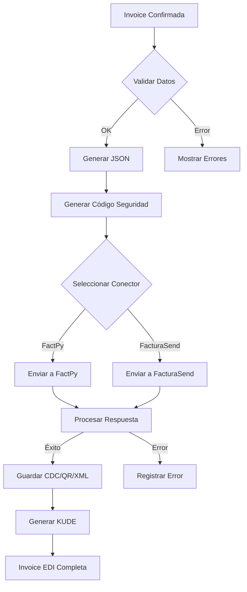

# Plano de Desenvolvimento - Integração Faturação Eletrônica Paraguai com Odoo

## 1. Arquitetura Modular Proposta

### 1.1 Estrutura de Módulos

```
odoo-addons/
├── l10n_py_edi_base/           # Módulo Base - Geração de Dados
│   ├── __manifest__.py
│   ├── models/
│   │   ├── account_move.py     # Extensão da Invoice
│   │   ├── res_partner.py      # Dados fiscais do parceiro
│   │   ├── res_company.py      # Configurações da empresa
│   │   ├── product_template.py # NCM e dados do produto
│   │   └── edi_document.py     # Modelo base para documentos
│   ├── data/
│   │   ├── edi_document_type.xml
│   │   └── py_states_cities.xml
│   └── views/
│
├── l10n_py_edi_factpy/          # Conector FactPy
│   ├── __manifest__.py
│   ├── models/
│   │   └── factpy_connector.py
│   └── wizards/
│
└── l10n_py_edi_facturasend/    # Conector FacturaSend
    ├── __manifest__.py
    ├── models/
    │   └── facturasend_connector.py
    └── wizards/
```

## 2. Módulo Base (l10n_py_edi_base)

### 2.1 Modelos de Dados

#### account.move (Extensão)

```python
class AccountMove(models.Model):
    _inherit = 'account.move'

    # Campos EDI Paraguai
    l10n_py_edi_document_type = fields.Selection([
        ('1', 'Factura Electrónica'),
        ('4', 'Autofactura Electrónica'),
        ('5', 'Nota de Crédito Electrónica'),
        ('6', 'Nota de Débito Electrónica'),
        ('7', 'Nota de Remisión Electrónica'),
    ])

    l10n_py_emission_type = fields.Selection([
        ('1', 'Normal'),
        ('2', 'Contingencia')
    ], default='1')

    l10n_py_transaction_type = fields.Selection([
        ('1', 'Venta de mercadería'),
        ('2', 'Prestación de servicios'),
        ('3', 'Mixto'),
        ('4', 'Venta de activo fijo'),
        ('5', 'Venta de divisas'),
        ('6', 'Compra de divisas'),
        ('7', 'Promoción o entrega de muestras'),
        ('8', 'Donación'),
        ('9', 'Anticipo'),
        ('10', 'Compra de productos'),
        ('11', 'Compra de servicios'),
        ('12', 'Venta de crédito fiscal'),
        ('13', 'Compra de crédito fiscal')
    ])

    l10n_py_cdc = fields.Char('CDC', readonly=True)
    l10n_py_qr_code = fields.Binary('QR Code')
    l10n_py_edi_xml = fields.Binary('XML Firmado')
    l10n_py_kude = fields.Binary('KUDE PDF')
    l10n_py_edi_status = fields.Selection([
        ('draft', 'Borrador'),
        ('to_send', 'Para Enviar'),
        ('sent', 'Enviado'),
        ('accepted', 'Aceptado'),
        ('rejected', 'Rechazado'),
        ('cancelled', 'Cancelado')
    ])

    l10n_py_security_code = fields.Char('Código de Seguridad', size=9)
    l10n_py_batch_id = fields.Char('ID de Lote')
```

#### res.partner (Extensión)

```python
class ResPartner(models.Model):
    _inherit = 'res.partner'

    l10n_py_ruc = fields.Char('RUC', help='Registro Único del Contribuyente')
    l10n_py_dv = fields.Char('DV', size=1, compute='_compute_dv')
    l10n_py_taxpayer_type = fields.Selection([
        ('1', 'Contribuyente'),
        ('2', 'No Contribuyente')
    ])
    l10n_py_document_type = fields.Selection([
        ('1', 'Cédula paraguaya'),
        ('2', 'Pasaporte'),
        ('3', 'Cédula extranjera'),
        ('4', 'Carnet de residencia'),
        ('5', 'Innominado'),
        ('9', 'Otro')
    ])

    # Campos de ubicación específicos
    l10n_py_department_code = fields.Integer('Código Departamento')
    l10n_py_district_code = fields.Integer('Código Distrito')
    l10n_py_city_code = fields.Integer('Código Ciudad')
```

### 2.2 Generador de Datos EDI

```python
class EDIDocumentBuilder:
    """Clase para construir el JSON del documento electrónico"""

    def build_invoice_data(self, invoice):
        return {
            "tipoDocumento": invoice.l10n_py_edi_document_type,
            "establecimiento": invoice.journal_id.l10n_py_establishment,
            "punto": invoice.journal_id.l10n_py_point,
            "numero": self._get_sequence_number(invoice),
            "fecha": invoice.invoice_date.isoformat(),
            "tipoEmision": invoice.l10n_py_emission_type,
            "tipoTransaccion": invoice.l10n_py_transaction_type,
            "moneda": invoice.currency_id.name,
            "cliente": self._build_customer_data(invoice.partner_id),
            "items": self._build_items_data(invoice.invoice_line_ids),
            "totales": self._calculate_totals(invoice),
            # ... más campos según requerimientos
        }

    def _build_customer_data(self, partner):
        """Construir datos del cliente"""
        return {
            "contribuyente": partner.l10n_py_taxpayer_type == '1',
            "ruc": f"{partner.l10n_py_ruc}-{partner.l10n_py_dv}" if partner.l10n_py_ruc else "",
            "razonSocial": partner.name,
            "tipoDocumento": partner.l10n_py_document_type,
            "numeroDocumento": partner.l10n_py_document_number,
            "direccion": partner.street,
            "numeroCasa": partner.l10n_py_house_number,
            "departamento": partner.l10n_py_department_code,
            "distrito": partner.l10n_py_district_code,
            "ciudad": partner.l10n_py_city_code,
            "pais": partner.country_id.code,
            "telefono": partner.phone,
            "celular": partner.mobile,
            "email": partner.email,
        }
```

## 3. Módulos de Integración

### 3.1 Conector Base (Abstract)

```python
class EDIConnectorBase(models.AbstractModel):
    _name = 'l10n_py.edi.connector.base'
    _description = 'Base EDI Connector for Paraguay'

    @abstractmethod
    def send_document(self, invoice_data):
        """Enviar documento al proveedor EDI"""
        pass

    @abstractmethod
    def check_status(self, batch_id):
        """Verificar estado del documento"""
        pass

    @abstractmethod
    def cancel_document(self, cdc):
        """Cancelar documento electrónico"""
        pass

    @abstractmethod
    def get_pdf(self, cdc):
        """Obtener KUDE (representación impresa)"""
        pass
```

### 3.2 Implementación FactPy

```python
class FactPyConnector(models.Model):
    _name = 'l10n_py.edi.connector.factpy'
    _inherit = 'l10n_py.edi.connector.base'

    api_key = fields.Char('API Key', required=True)
    api_secret = fields.Char('API Secret', required=True)
    environment = fields.Selection([
        ('test', 'Pruebas'),
        ('prod', 'Producción')
    ])

    def send_document(self, invoice_data):
        headers = {
            'Authorization': f'Bearer {self._get_token()}',
            'Content-Type': 'application/json'
        }

        response = requests.post(
            f'{self._get_base_url()}/api/v1/invoices',
            json=invoice_data,
            headers=headers
        )

        return response.json()
```

### 3.3 Implementación FacturaSend

```python
class FacturaSendConnector(models.Model):
    _name = 'l10n_py.edi.connector.facturasend'
    _inherit = 'l10n_py.edi.connector.base'

    api_key = fields.Char('API Key', required=True)
    tenant_id = fields.Char('Tenant ID', required=True)

    def send_document(self, invoice_data):
        headers = {
            'Authorization': f'Bearer {self.api_key}'
        }

        # Adaptar formato según FacturaSend
        adapted_data = self._adapt_to_facturasend_format(invoice_data)

        response = requests.post(
            f'https://api.facturasend.com.py/{self.tenant_id}/lote/create',
            json=[adapted_data],
            headers=headers
        )

        return response.json()
```

## 4. Flujo de Procesamiento

### 4.1 Workflow Principal



### 4.2 Validaciones Pre-envío

```python
class InvoiceEDIValidator:

    def validate_invoice(self, invoice):
        errors = []

        # Validar RUC
        if not self._validate_ruc(invoice.partner_id.l10n_py_ruc):
            errors.append('RUC inválido')

        # Validar datos obligatorios
        if not invoice.partner_id.street:
            errors.append('Dirección del cliente requerida')

        # Validar NCM en productos
        for line in invoice.invoice_line_ids:
            if not line.product_id.l10n_py_ncm:
                errors.append(f'NCM faltante en {line.product_id.name}')

        # Validar timbrado
        if not invoice.journal_id.l10n_py_timbrado:
            errors.append('Timbrado no configurado')

        return errors

    def _validate_ruc(self, ruc):
        """Validar RUC con dígito verificador"""
        if not ruc:
            return False

        # Algoritmo de validación del DV
        # ...
        return True
```

## 5. Cronograma de Implementación

### Fase 1: Configuración Base (2 semanas)

- [ ] Crear estructura de módulos
- [ ] Implementar modelos base
- [ ] Cargar datos maestros (departamentos, ciudades)
- [ ] Configurar vistas y formularios

### Fase 2: Generador de Datos (2 semanas)

- [ ] Implementar builder de JSON
- [ ] Crear validadores
- [ ] Implementar cálculo de impuestos (IVA 5%, 10%, exento)
- [ ] Generar código de seguridad aleatorio

### Fase 3: Conectores API (3 semanas)

- [ ] Implementar conector FactPy
- [ ] Implementar conector FacturaSend
- [ ] Crear sistema de logs
- [ ] Implementar manejo de errores

### Fase 4: Procesamiento de Respuestas (2 semanas)

- [ ] Procesar CDC
- [ ] Generar y almacenar QR
- [ ] Guardar XML firmado
- [ ] Implementar consulta de estado

### Fase 5: KUDE y Reportes (1 semana)

- [ ] Diseñar template KUDE
- [ ] Implementar generación PDF
- [ ] Crear reportes de control

### Fase 6: Testing y Homologación (2 semanas)

- [ ] Pruebas unitarias
- [ ] Pruebas de integración
- [ ] Homologación con SET
- [ ] Pruebas en ambiente de producción

## 6. Configuración de Ambiente

### 6.1 Requirements Python

```txt
requests>=2.28.0
qrcode>=7.3.1
reportlab>=3.6.12
cryptography>=38.0.0
zeep>=4.2.1  # Para SOAP si necesario
```

### 6.2 Configuración Odoo

```python
# res_config_settings.py
class ResConfigSettings(models.TransientModel):
    _inherit = 'res.config.settings'

    l10n_py_edi_provider = fields.Selection([
        ('factpy', 'FactPy'),
        ('facturasend', 'FacturaSend')
    ], config_parameter='l10n_py.edi_provider')

    l10n_py_edi_environment = fields.Selection([
        ('test', 'Pruebas'),
        ('prod', 'Producción')
    ], config_parameter='l10n_py.edi_environment')
```

## 7. Tratamiento de Errores

### 7.1 Categorías de Errores

```python
ERROR_CODES = {
    'VAL001': 'Datos de cliente incompletos',
    'VAL002': 'RUC inválido',
    'VAL003': 'NCM no especificado',
    'API001': 'Error de conexión con proveedor',
    'API002': 'Credenciales inválidas',
    'API003': 'Límite de rate excedido',
    'SET001': 'Documento rechazado por SET',
    'SET002': 'Timbrado vencido',
}
```

### 7.2 Sistema de Reintentos

```python
class EDIRetryMixin:

    @retry(max_attempts=3, delay=60)
    def send_with_retry(self, invoice):
        try:
            return self.send_document(invoice)
        except ConnectionError:
            raise RetryException("Error de conexión")
```

## 8. Monitoreo y Logs

```python
class EDILog(models.Model):
    _name = 'l10n_py.edi.log'

    invoice_id = fields.Many2one('account.move')
    action = fields.Selection([
        ('send', 'Envío'),
        ('receive', 'Respuesta'),
        ('error', 'Error'),
        ('cancel', 'Cancelación')
    ])
    request_data = fields.Text()
    response_data = fields.Text()
    status_code = fields.Integer()
    timestamp = fields.Datetime(default=fields.Datetime.now)
```

## 9. Consideraciones de Seguridad

- Almacenar API keys encriptadas
- Usar HTTPS para todas las comunicaciones
- Implementar rate limiting interno
- Logs sin datos sensibles
- Backup de XMLs firmados

## 10. Testing

### 10.1 Tests Unitarios

```python
class TestEDIBuilder(TestCase):

    def test_ruc_validation(self):
        self.assertTrue(validate_ruc('80009401-6'))
        self.assertFalse(validate_ruc('80009401-7'))

    def test_invoice_json_generation(self):
        invoice = self.create_test_invoice()
        json_data = EDIBuilder().build(invoice)
        self.assertEqual(json_data['tipoDocumento'], '1')
```

### 10.2 Tests de Integración

- Envío en ambiente de pruebas
- Validación de respuestas
- Generación de KUDE
- Cancelación de documentos

## 11. Documentación Necesaria

- Manual de instalación
- Guía de configuración
- Manual de usuario
- Documentación técnica de APIs
- Troubleshooting guide
- Mapeo de campos SET -> Odoo

## 12. Próximos Pasos

1. Revisar documentación oficial del SET
2. Obtener credenciales de prueba
3. Configurar ambiente de desarrollo
4. Comenzar con Fase 1
